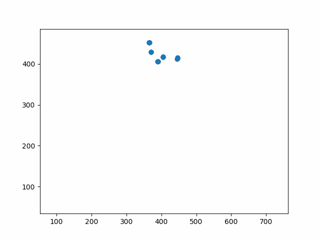
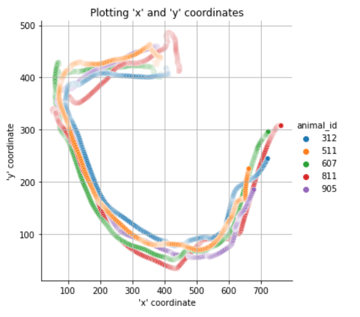
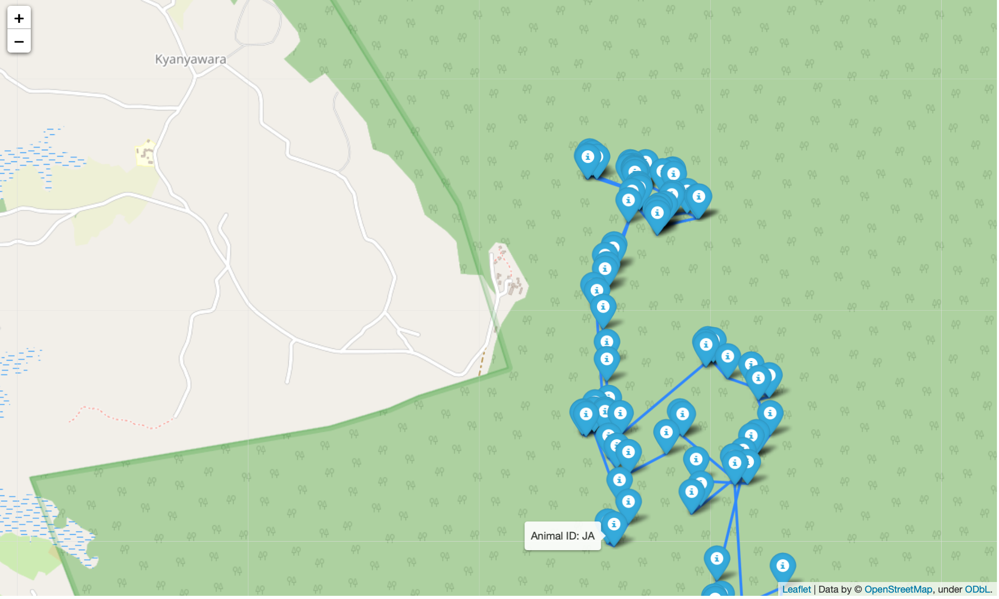
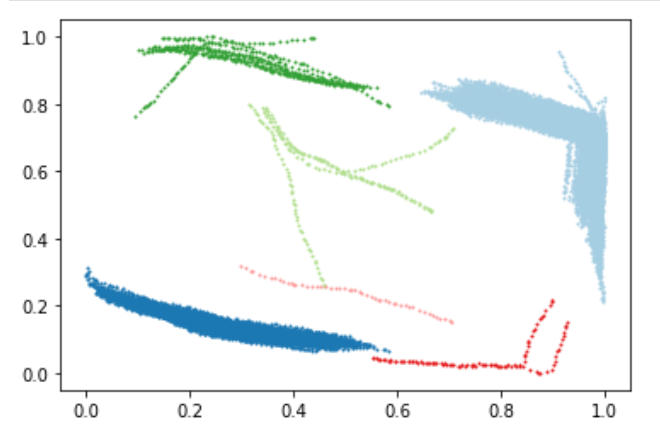

=======
movekit
=======

This is the documentation of **movekit**.

.. image:: ../media/voronoi.png
   :width: 250px
   :height: 200px
.. image:: ../media/network.png
   :width: 250px
   :height: 200px

movekit is an open-source software package for the processing and analysis of movement data. It has several selling points, for example

* Data pre-processing (e.g. data checks, smoothing, duplicate removal, interpolation, ...)
* Feature extraction (e.g. speed, acceleration, heading, distance, environment exploration, outlier detection, ...)
* Group-level analysis (e.g. centroid/medoid computations, polarization, coordination, leadership, clustering, ...)
* Spatial data analysis (Compute Convex hull, voronoi diagram and delaunay triangulation objects)
* Network analysis with networkX (e.g. analyze network graphs over time, individual nodes, individual edges, ...)
* Various plots (e.g.plots of features, static/animated plots of movement, interactive maps for geo data, ...)

Contents
========

.. toctree::
   :maxdepth: 2

   Quick Start <quick_start>
   Data Cleaning Notebook <examples/01_data_cleaning>
   Feature Extraction <features.rst>
   Feature Extraction Notebook <examples/02_extract_features>
   Group Features <group_features.rst>
   Group Feature Extraction Notebook <examples/03_group_features>
   Spatial Analysis <spatial_analysis.rst>
   Spatial Analysis Notebook <examples/04_spatial_analysis>
   Network Analysis <network.rst>
   Network Analysis Notebook <examples/05_network_analysis>
   Spatio-Temporal Clustering <clustering.rst>
   Cluster Analysis Notebook <examples/06_clustering>
   Movebank Notebook <examples/07_movebank>
   License <license>
   Authors <authors> 
   Changelog <changelog>
   Module Reference <api/modules>

Indices and tables
==================

* :ref:`genindex`
* :ref:`modindex`
* :ref:`search`

.. _toctree: http://www.sphinx-doc.org/en/master/usage/restructuredtext/directives.html
.. _reStructuredText: http://www.sphinx-doc.org/en/master/usage/restructuredtext/basics.html
.. _references: http://www.sphinx-doc.org/en/stable/markup/inline.html
.. _Python domain syntax: http://sphinx-doc.org/domains.html#the-python-domain
.. _Sphinx: http://www.sphinx-doc.org/
.. _Python: http://docs.python.org/
.. _Numpy: http://docs.scipy.org/doc/numpy
.. _SciPy: http://docs.scipy.org/doc/scipy/reference/
.. _matplotlib: https://matplotlib.org/contents.html#
.. _Pandas: http://pandas.pydata.org/pandas-docs/stable
.. _Scikit-Learn: http://scikit-learn.org/stable
.. _autodoc: http://www.sphinx-doc.org/en/stable/ext/autodoc.html
.. _Google style: https://github.com/google/styleguide/blob/gh-pages/pyguide.md#38-comments-and-docstrings
.. _NumPy style: https://numpydoc.readthedocs.io/en/latest/format.html
.. _classical style: http://www.sphinx-doc.org/en/stable/domains.html#info-field-lists

Acknowledgments
===============
movekit is funded by the Deutsche Forschungsgemeinschaft (DFG, German Research Foundation) under Germany's Excellence Strategy – EXC 2117 – 422037984.
